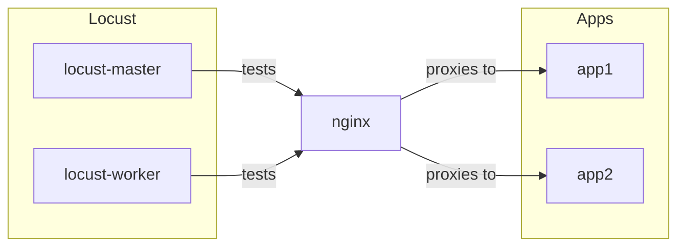

# Load Balancing, Reverse Proxy, and Stress Test using NGINX and Locust

This project sets up a simple architecture to demonstrate load balancing, reverse proxying, and stress testing using NGINX and Locust. 

## Project Structure

```
├── app.py
├── docker-compose.yaml
├── Dockerfile
├── locust
│   └── locust-task.py
├── nginx.conf
├── README.md
└── requirements.txt
```

## Docker Compose Configuration

The `docker-compose.yaml` file defines the services and their configuration:

```yaml
services:
  nginx:
    image: nginx:latest
    container_name: ngong
    ports:
      - "8080:80"
    volumes:
      - ./nginx.conf:/etc/nginx/conf.d/default.conf
    depends_on:
      - app1
      - app2

  app1:
    build: .
    container_name: app1
    ports:
      - "3001:3000"
    volumes:
      - .:/app

  app2:
    build: .
    container_name: app2
    ports:
      - "3002:3000"
    volumes:
      - .:/app

  locust-master:
    image: locustio/locust
    ports:
      - "8089:8089"
    volumes:
      - ./locust:/mnt/locust
    command: -f /mnt/locust/locust-task.py --master --host http://ngong:80

  locust-worker:
    image: locustio/locust
    volumes:
      - ./locust:/mnt/locust
    command: -f /mnt/locust/locust-task.py --worker --master-host locust-master 
```

### Services

- **nginx**: Acts as a reverse proxy to distribute traffic between `app1` and `app2`.
- **app1** and **app2**: Two instances of the application being tested.
- **locust-master**: The master node for running Locust tests.
- **locust-worker**: The worker node for running Locust tests.

## Running the Experiment

1. **Build and run the services**:
   ```sh
   docker-compose up --build
   ```

2. **Access the application** via NGINX at [http://localhost:8080](http://localhost:8080).

3. **Access Locust** web interface at [http://localhost:8089](http://localhost:8089) to start the stress test.


